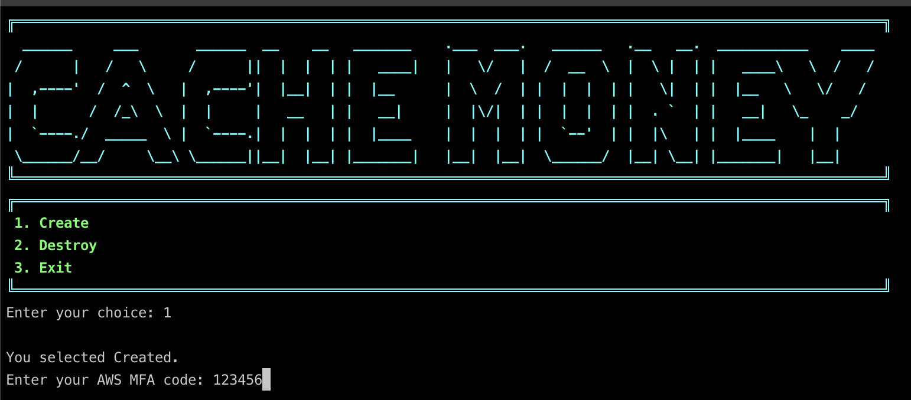
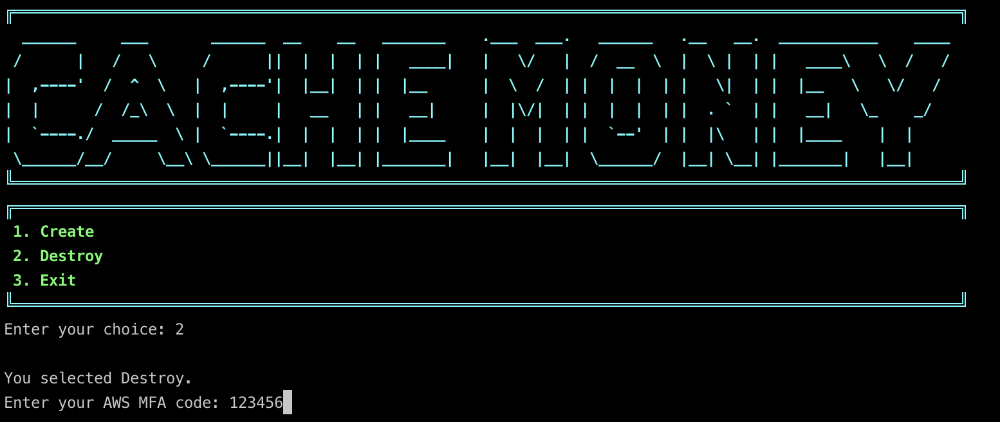
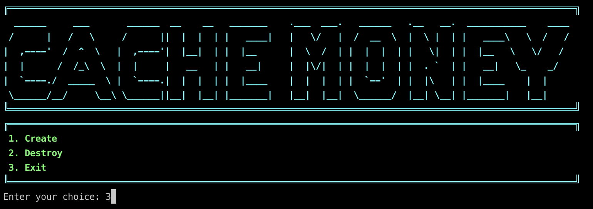

<div align="center">
  
</div>

## AWS and Terraform Setup
[](https://aws.amazon.com/cli/) [](https://www.terraform.io/downloads.html) [](https://stedolan.github.io/jq/download/) [](https://aws.amazon.com/contact-us/)


To use AWS CLI, Terraform, and jq, you need to set up the following dependencies:

1. **Terraform**: Terraform is an infrastructure-as-code tool that allows you to provision and manage cloud resources. Follow these steps to install it:

   - **MacOS**: Install using Homebrew by running the following command in the terminal:
     ```
     brew install terraform
     ```
   - **Linux**: Download the Terraform ZIP archive for Linux from the [official website](https://www.terraform.io/downloads.html) and extract it to a directory included in your system's PATH.

2. **jq**: jq is a lightweight and flexible command-line JSON processor. It is useful for parsing and manipulating JSON data. Follow the instructions below to install it:

   - **MacOS**: Install using Homebrew by running the following command in the terminal:
     ```
     brew install jq
     ```
   - **Linux**: Install using your package manager. For example, on Ubuntu, you can run:
     ```
     sudo apt-get install jq
     ```
3. **AWS CLI**: The AWS Command Line Interface (CLI) allows you to interact with AWS services from the command line. Before installing it, ensure that you have the following AWS credentials available:

   - **AWS Access Key ID**: Obtain this key from your AWS account administrator or DevOps team.
   - **AWS Secret Access Key**: Obtain this key from your AWS account administrator or DevOps team.
   - **AWS Region**: Determine the AWS region that you want to work with.

## Configuration Files

Once you have installed AWS CLI and Terraform, you need to create and update the following configuration files:

1. **myvars.auto.tfvars**: Create a file named `myvars.auto.tfvars` in your Terraform project directory. This file is used to define variables specific to your project. Update its content according to your needs.

   Example `myvars.auto.tfvars` content:
  ```
  cache_money_cli = {
    fe_repo_name   = "hackathon-FE"
    fe_branch_name = "dev"
    be_repo_name   = "hackathon-BE"
    be_branch_name = "dev"
    access_token   = "your_github_access_token"
  }
  
  aws_envs = {
    AWS_MFA_DEVICE_ARN    = "your MFA ARN"
    aws_profile           = "hackathon"
    AWS_ACCESS_KEY_ID     = "Your AWS Access Key"
    AWS_SECRET_ACCESS_KEY = "Your AWS Secret Key "
  }
  ```
2. **backend.tf**: Create a file named `backend.tf` in your Terraform project directory. This file is used to configure the backend where Terraform state is stored. Update its `<yourname>` from the provided `backend.tf.example` file.

Example `backend.tf` content:
```
# update your name in the key path
# copy this backend file with the name backend.tf
terraform {
  backend "s3" {
    bucket = "hackathon-2024-terraform-state"
    key    = "<yourname>/terraform.tfstate"
    region = "us-east-1"
  }
}
```

Make sure to replace the placeholder values in the example files with your own configurations.

That's it! You have now installed the necessary dependencies (AWS CLI, Terraform, and `jq`), and you can use the `aws_cli.sh` script to manage your AWS resources.
You have now installed the necessary dependencies and created the required configuration files for AWS CLI and Terraform. You can proceed with your infrastructure provisioning and management tasks using Terraform.

## Obtaining AWS Credentials

Before proceeding with the installation, you need to obtain your AWS credentials. Follow these steps to get the necessary information:

1. **AWS Access Key ID and Secret Access Key**: Reach out to your AWS account administrator or DevOps team to obtain the AWS Access Key ID and Secret Access Key. These credentials are used to authenticate your AWS CLI requests.

2. **AWS Region**: Determine the AWS region that you want to work with. This information specifies the geographical region where your resources will be provisioned.

## Setting Up MFA (Multi-Factor Authentication)

If your AWS account has Multi-Factor Authentication (MFA) enabled, follow these steps to obtain an MFA device and generate an MFA token:

1. **Obtain MFA Device**: Contact your AWS account administrator or DevOps team to obtain an MFA device, such as a hardware token or virtual MFA application.

2. **Configure MFA Device**: Set up the MFA device by following the instructions provided by your administrator or in the AWS Management Console.

3. **Generate MFA Token**: Once your MFA device is set up, you can generate an MFA token using tools such as the AWS CLI. The token is required for certain AWS operations.

For detailed instructions on setting up MFA and generating MFA tokens, refer to the [AWS documentation](https://docs.aws.amazon.com/IAM/latest/UserGuide/id_credentials_mfa.html).

## Run AWS CLI Script

After installing the dependencies, you can run the `aws_cli.sh` script to perform various actions. Follow these steps:

1. Open a terminal or command prompt.
2. Navigate to the directory where the `aws_cli.sh` script is located.
3. Run the script by executing the following command:

./aws_cli.sh

The script provides the following options:

1. **Create**: This option allows you to create AWS resources using Terraform. It will execute the necessary Terraform commands to provision your infrastructure based on your configuration files.



2. **Destroy**: This option allows you to destroy AWS resources provisioned by Terraform. It will execute the necessary Terraform commands to tear down your infrastructure.



3. **Exit**: This option allows you to exit the script.



